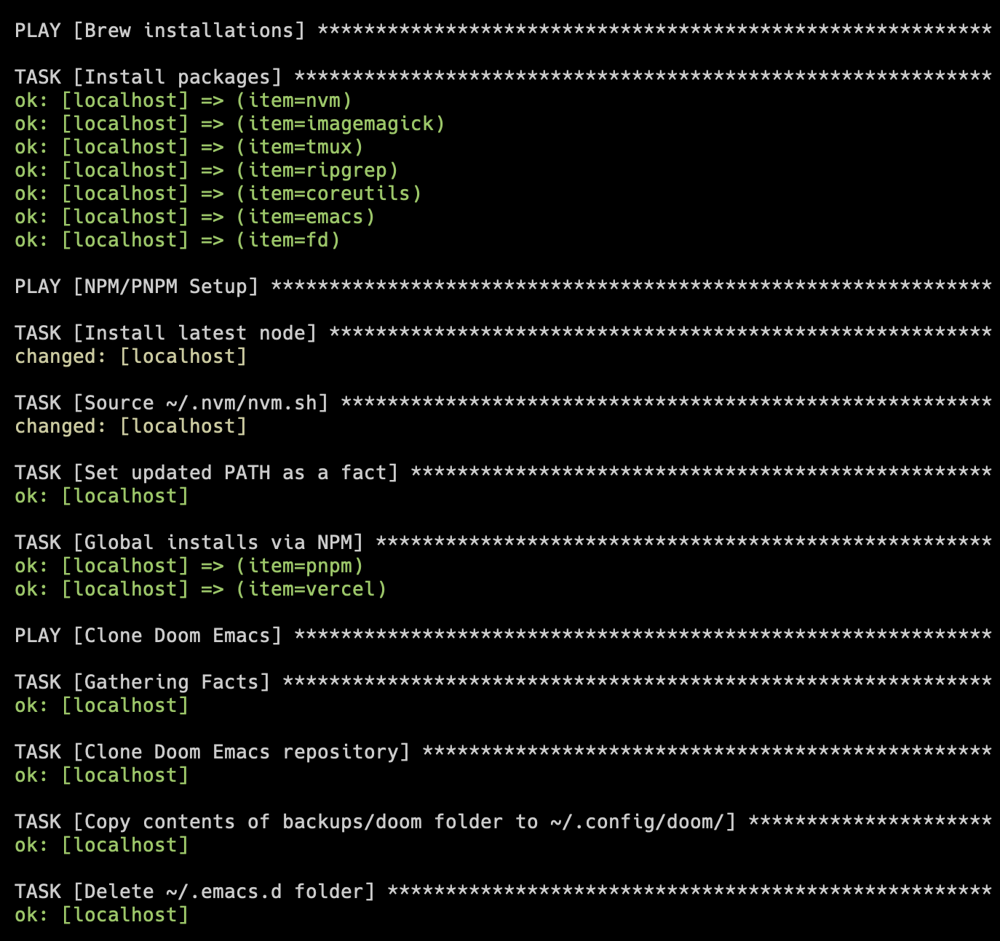

# Dotfiles

This repository contains configuration files and scripts to set up a macOS development environment.

It automates the installation of various tools and packages, including:
- Common homebrew packages
- Commmon node packages
- Zsh
- Doom Emacs

It uses an **Ansible playbook** under the hood to do all of that

## Getting Started

To set up your macOS development environment, follow these steps:

1. Clone the repository: `git clone https://github.com/patrixr/dotfiles.git`
2. Go into the `dotfiles` directory: `cd dotfiles`
3. Run the `dependencies.sh` script to install dependencies required by the playbook: `./dependencies.sh`
4. Run the `apply.sh` script to run the Ansible playbook: `./apply.sh`

You can also run `apply.sh` whenever you want to update the installed packages to the latest version or apply changes to the setup.

## Files and Scripts

The repository contains several files and scripts:

### dependencies.sh

A bash script that installs the initial dependencies required to run the Ansible playbook. It installs Homebrew, Zsh, and Ansible. It also sets up the Oh My Zsh framework, appends `zshrc-addons` to the user's `.zshrc` file, and installs the `community.general` Ansible collection.

### apply.sh

A shell script that triggers the Ansible playbook `setup.yml`. Before running the playbook, it installs the `community.general` Ansible collection.

### setup.yml

An Ansible playbook that automates the installation and configuration of various packages and tools for a macOS development environment. It consists of three main sections:

1. **Brew installations**: Installs packages using Homebrew, including `nvm`, `imagemagick`, `tmux`, `ripgrep`, `coreutils`, `emacs`, and `fd`.
2. **NPM/PNPM Setup**: Installs the latest Node.js version using `nvm`, then installs global NPM packages `pnpm` and `vercel`.
3. **Install Doom Emacs**: Clones the Doom Emacs repository, copies the contents of the `backups/doom` folder to the `~/.config/doom/` folder, deletes the `~/.emacs.d` folder, and provides instructions for installing or synchronizing Doom Emacs.

## Customizations

To customize the installed packages or configurations, modify the `setup.yml` file and add or remove tasks as needed. Refer to the Ansible documentation and the corresponding modules for each package manager or tool for customization options.

For example, to add a new Homebrew package, add the package name to the `loop` list in the "Install packages" task under the "Brew installations" section. For NPM packages, add the package name to the `loop` list in the "Global installs via NPM" task under the "NPM/PNPM Setup" section.
